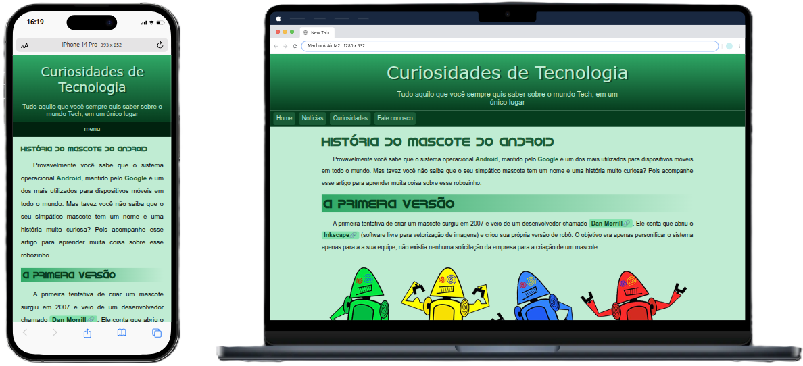
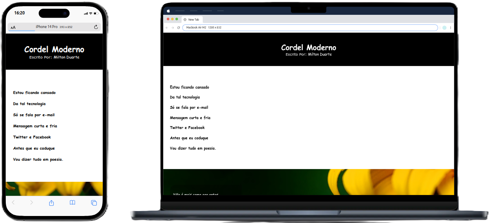
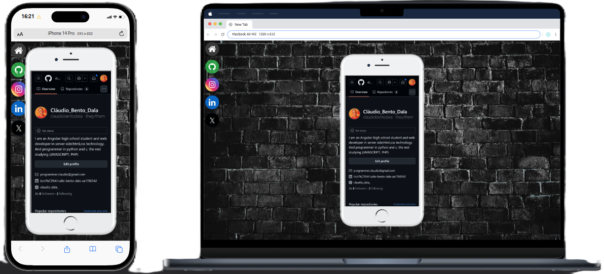

# 🌐 HTML and CSS Exercises Repository

## 🔗 Visit all project

📍 [ANDROID HISTORY](https://claudiobentodaladev.github.io/HTMLCSS/android/)
📍 [CORDEL](https://claudiobentodaladev.github.io/HTMLCSS/cordel)
📍 [SOCIAL MIDIA](https://claudiobentodaladev.github.io/HTMLCSS/social)
📍 [LOGIN](https://claudiobentodaladev.github.io/HTMLCSS/login)

## 📷 Screenshots

This repository contains **HTML** and **CSS** exercises focused on building static and responsive web pages.

## 📘 About HTML and CSS

- **HTML (HyperText Markup Language)** is the standard language used to structure content on the web.
- **CSS (Cascading Style Sheets)** is the styling language used to control the look and layout of web pages, including colors, fonts, and responsiveness.

Together, they form the foundation of all web frontend development.

## 🎯 Repository Purpose

- Practice building simple and responsive web pages
- Learn best practices in structuring and styling content
- Build portfolios, landing pages, and basic layouts

## 🎓 Recommended Courses

- [HTML & CSS – Curso em Vídeo (Free)](https://www.cursoemvideo.com/curso/html5-css3/)
- [HTML and CSS for Beginners – Origamid](https://www.origamid.com/curso/html-e-css-para-iniciantes/)
- [Responsive Web Design – freeCodeCamp](https://www.freecodecamp.org/learn/)
- [HTML and CSS: From Basic to Advanced – Udemy](https://www.udemy.com/course/html5-css3-completo/)